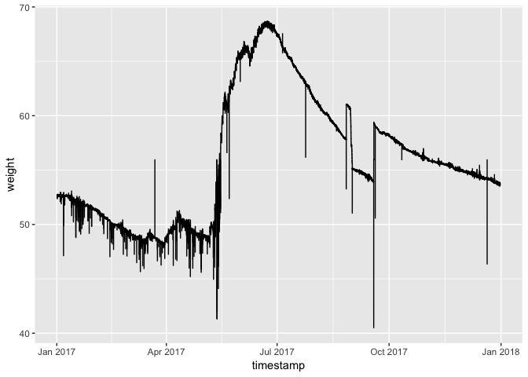

Beehive Metrics
================
Joel Smith
4/30/2019

### Check which level the time series are recorded

Flow is at the minute level. However, there are two recordings (often different) of flow for each timestamp. This does not lend itself to time series analysis.

``` r
head(flow[order(flow$timestamp),], 10)
```

    ## # A tibble: 10 x 2
    ##    timestamp            flow
    ##    <dttm>              <int>
    ##  1 2017-01-01 05:15:00     0
    ##  2 2017-01-01 05:15:00     0
    ##  3 2017-01-01 05:16:00     0
    ##  4 2017-01-01 05:16:00     0
    ##  5 2017-01-01 05:17:00     0
    ##  6 2017-01-01 05:17:00     0
    ##  7 2017-01-01 05:18:00     0
    ##  8 2017-01-01 05:18:00     0
    ##  9 2017-01-01 05:19:00     0
    ## 10 2017-01-01 05:19:00     0

``` r
tail(flow[order(flow$timestamp),], 10)
```

    ## # A tibble: 10 x 2
    ##    timestamp            flow
    ##    <dttm>              <int>
    ##  1 2017-12-31 05:10:00     0
    ##  2 2017-12-31 05:10:00     0
    ##  3 2017-12-31 05:11:00     0
    ##  4 2017-12-31 05:11:00     0
    ##  5 2017-12-31 05:12:00     0
    ##  6 2017-12-31 05:12:00     0
    ##  7 2017-12-31 05:13:00     0
    ##  8 2017-12-31 05:13:00     0
    ##  9 2017-12-31 05:14:00     0
    ## 10 2017-12-31 05:14:00     0

``` r
flow[order(flow$timestamp)[260001:260011],]
```

    ## # A tibble: 11 x 2
    ##    timestamp            flow
    ##    <dttm>              <int>
    ##  1 2017-04-01 12:55:00   -45
    ##  2 2017-04-01 12:55:00    24
    ##  3 2017-04-01 12:56:00   -47
    ##  4 2017-04-01 12:56:00    46
    ##  5 2017-04-01 12:57:00   -33
    ##  6 2017-04-01 12:57:00    36
    ##  7 2017-04-01 12:58:00   -47
    ##  8 2017-04-01 12:58:00    43
    ##  9 2017-04-01 12:59:00   -49
    ## 10 2017-04-01 12:59:00    35
    ## 11 2017-04-01 13:00:00   -47

Humidity is at the hour level.

``` r
head(humidity[order(humidity$timestamp),], 10)
```

    ## # A tibble: 10 x 2
    ##    timestamp           humidity
    ##    <dttm>                 <dbl>
    ##  1 2017-01-01 05:00:00     92.4
    ##  2 2017-01-01 06:00:00     92.3
    ##  3 2017-01-01 07:00:00     92.6
    ##  4 2017-01-01 08:00:00     92.8
    ##  5 2017-01-01 09:00:00     93.6
    ##  6 2017-01-01 10:00:00     93.8
    ##  7 2017-01-01 11:00:00     93.0
    ##  8 2017-01-01 12:00:00     92.1
    ##  9 2017-01-01 13:00:00     91.4
    ## 10 2017-01-01 14:00:00     91.1

``` r
tail(humidity[order(humidity$timestamp),], 10)
```

    ## # A tibble: 10 x 2
    ##    timestamp           humidity
    ##    <dttm>                 <dbl>
    ##  1 2017-12-30 20:00:00     89.1
    ##  2 2017-12-30 21:00:00     87.9
    ##  3 2017-12-30 22:00:00     90.1
    ##  4 2017-12-30 23:00:00     91.6
    ##  5 2017-12-31 00:00:00     91.3
    ##  6 2017-12-31 01:00:00     90.3
    ##  7 2017-12-31 02:00:00     91.7
    ##  8 2017-12-31 03:00:00     92.3
    ##  9 2017-12-31 04:00:00     92.7
    ## 10 2017-12-31 05:00:00     91.9

Temperature is at the hour level or 5-minute increment level. Like flow, temperature also has multiple recordings for temperature at the same timestamp. These values are different enough that an average per timestamp does not make sense.

``` r
head(temp[order(temp$timestamp),], 10)
```

    ## # A tibble: 10 x 2
    ##    timestamp           temperature
    ##    <dttm>                    <dbl>
    ##  1 2017-01-01 05:00:00      -1.91 
    ##  2 2017-01-01 05:00:00      -0.269
    ##  3 2017-01-01 05:00:00       0.554
    ##  4 2017-01-01 05:00:00       3.43 
    ##  5 2017-01-01 05:00:00       2.19 
    ##  6 2017-01-01 05:00:00       2.85 
    ##  7 2017-01-01 05:00:00       4.51 
    ##  8 2017-01-01 05:00:00       1.36 
    ##  9 2017-01-01 05:00:00       3.20 
    ## 10 2017-01-01 05:00:00       1.09

``` r
tail(temp[order(temp$timestamp),], 10)
```

    ## # A tibble: 10 x 2
    ##    timestamp           temperature
    ##    <dttm>                    <dbl>
    ##  1 2017-12-31 05:00:00        11.9
    ##  2 2017-12-31 05:00:00        11.1
    ##  3 2017-12-31 05:00:00        11.0
    ##  4 2017-12-31 05:00:00        12.2
    ##  5 2017-12-31 05:05:00        18.8
    ##  6 2017-12-31 05:05:00        11.0
    ##  7 2017-12-31 05:05:00        12.2
    ##  8 2017-12-31 05:10:00        18.6
    ##  9 2017-12-31 05:10:00        11.1
    ## 10 2017-12-31 05:10:00        12.2

Weight is at the minute level.

``` r
head(weight[order(weight$timestamp),], 10)
```

    ## # A tibble: 10 x 2
    ##    timestamp           weight
    ##    <dttm>               <dbl>
    ##  1 2017-01-01 05:15:00   52.7
    ##  2 2017-01-01 05:16:00   52.7
    ##  3 2017-01-01 05:17:00   52.7
    ##  4 2017-01-01 05:18:00   52.7
    ##  5 2017-01-01 05:19:00   52.7
    ##  6 2017-01-01 05:20:00   52.7
    ##  7 2017-01-01 05:21:00   52.7
    ##  8 2017-01-01 05:22:00   52.7
    ##  9 2017-01-01 05:23:00   52.7
    ## 10 2017-01-01 05:24:00   52.7

``` r
tail(weight[order(weight$timestamp),], 10)
```

    ## # A tibble: 10 x 2
    ##    timestamp           weight
    ##    <dttm>               <dbl>
    ##  1 2017-12-31 05:05:00   53.7
    ##  2 2017-12-31 05:06:00   53.6
    ##  3 2017-12-31 05:07:00   53.6
    ##  4 2017-12-31 05:08:00   53.7
    ##  5 2017-12-31 05:09:00   53.7
    ##  6 2017-12-31 05:10:00   53.8
    ##  7 2017-12-31 05:11:00   53.7
    ##  8 2017-12-31 05:12:00   53.7
    ##  9 2017-12-31 05:13:00   53.7
    ## 10 2017-12-31 05:14:00   53.8

### Check for missing values

``` r
sum(is.na(flow))
```

    ## [1] 0

``` r
sum(is.na(humidity))
```

    ## [1] 0

``` r
sum(is.na(weight))
```

    ## [1] 0

There are 3 missing values -- each in the temperature column.

``` r
sum(is.na(temp))
```

    ## [1] 3

``` r
sum(is.na(temp$timestamp))
```

    ## [1] 0

``` r
sum(is.na(temp$temperature))
```

    ## [1] 3

Oddly, these are all at the same time. We do not have a temperature for this timestamp, but it is difficult to impute due to the previously mentioned fact of having multiple temperature values at each timestamp.

``` r
temp[is.na(temp$temperature),]
```

    ## # A tibble: 3 x 2
    ##   timestamp           temperature
    ##   <dttm>                    <dbl>
    ## 1 2017-01-01 05:10:00          NA
    ## 2 2017-01-01 05:10:00          NA
    ## 3 2017-01-01 05:10:00          NA

``` r
temp[temp$timestamp == as.POSIXct("2017-01-01 05:10:00", tz = "UTC"),]
```

    ## # A tibble: 3 x 2
    ##   timestamp           temperature
    ##   <dttm>                    <dbl>
    ## 1 2017-01-01 05:10:00          NA
    ## 2 2017-01-01 05:10:00          NA
    ## 3 2017-01-01 05:10:00          NA

``` r
temp[temp$timestamp == as.POSIXct("2017-01-01 05:10:00", tz = "UTC"),]
```

    ## # A tibble: 3 x 2
    ##   timestamp           temperature
    ##   <dttm>                    <dbl>
    ## 1 2017-01-01 05:10:00          NA
    ## 2 2017-01-01 05:10:00          NA
    ## 3 2017-01-01 05:10:00          NA

### Plot each of the time series

##### Flow

``` r
ggplot(flow, aes(timestamp, flow)) +
  geom_line()
```


Zoom in on flow to look for hourly patterns.

``` r
ggplot(flow %>%
         filter(between(timestamp, as.POSIXct("2017-06-01 01:00:00"), as.POSIXct("2017-06-05 01:00:00"))),
       aes(timestamp, flow)) +
  geom_line()
```


It appears that flow peaks sometime around mid-afternoon.

``` r
ggplot(flow %>%
         filter(between(timestamp, as.POSIXct("2017-06-01 01:00:00"), as.POSIXct("2017-06-01 23:00:00"))),
       aes(timestamp, flow)) +
  geom_line()
```


##### Humidity

It looks like we need to remove an outlier.

``` r
ggplot(humidity, aes(timestamp, humidity)) +
  geom_line()
```


Let's find that outlier...

``` r
min(humidity[,2])
```

    ## [1] -66.71

...and remove it.

``` r
humidity = humidity[-which(humidity$humidity == min(humidity$humidity)),]
```

Check for another outlier. There is one, so let's remove it.

``` r
min(humidity[,2])
```

    ## [1] -50.23333

``` r
humidity = humidity[-which(humidity$humidity == min(humidity$humidity)),]
```

Check for another outlier. It looks like we are all set.

``` r
min(humidity[,2])
```

    ## [1] 33.54767

Plot humidity again. Looks good.

``` r
ggplot(humidity, aes(timestamp, humidity)) +
  geom_line()
```


##### Temperature

Plot two series of yearly temperature data.

``` r
ggplot(temp[1:8737,], aes(timestamp, temperature)) +
  geom_line()
```


``` r
ggplot(temp[8738:17474,], aes(timestamp, temperature)) +
  geom_line()
```


##### Weight

There are a couple of values of 0 for the weight. We should find the values around each of these points and determine how to fill in the zero. However, I am just going to replace with the overall mean.

``` r
ggplot(weight, aes(timestamp, weight)) +
  geom_line()
```


``` r
weight$weight = ifelse(weight$weight < 0, mean(weight$weight), weight$weight)
```

Check the plot.

``` r
ggplot(weight, aes(timestamp, weight)) +
  geom_line()
```


We should adjust the other low values as well.

``` r
weight$weight = ifelse(weight$weight < 20, mean(weight$weight), weight$weight)
```

Re-check the plot.

``` r
ggplot(weight, aes(timestamp, weight)) +
  geom_line()
```


Fix the two lowest points.

``` r
weight$weight = ifelse(weight$weight < 40, mean(weight$weight), weight$weight)
```

Re-check the plot again.

``` r
ggplot(weight, aes(timestamp, weight)) +
  geom_line()
```



Fix the low point around October.

``` r
weight$weight = ifelse(weight$weight == min(weight$weight), mean(weight$weight), weight$weight)
```

Re-check the plot again.

``` r
ggplot(weight, aes(timestamp, weight)) +
  geom_line()
```


This is a slow process, there is likely a much better way to deal with this.
